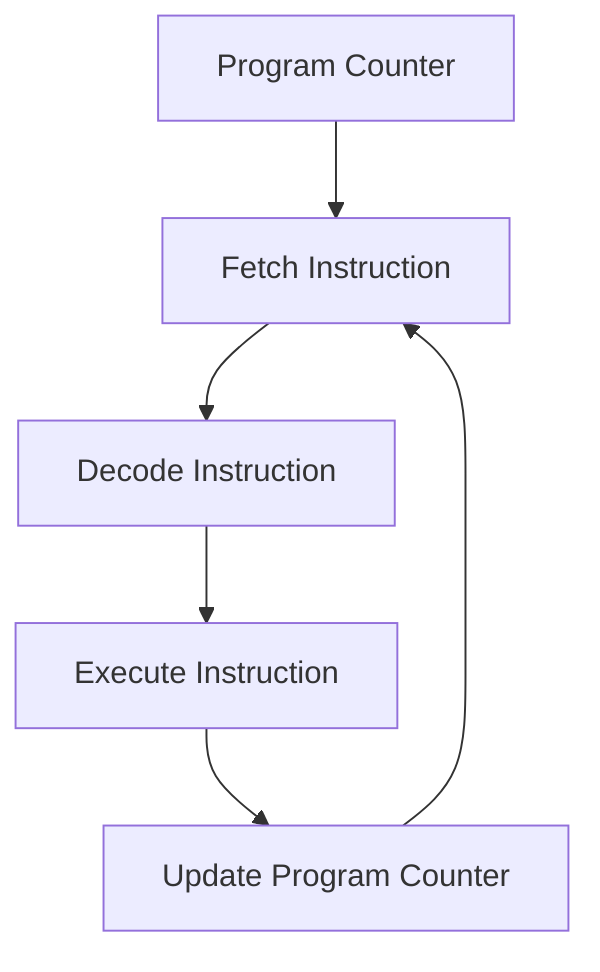

# CPU Starts Executing

> *"The executable is now in memory. The process exists. The scheduler has selected it. For the first time, the CPU is about to execute your program."*

---

# Learning Objectives

After completing this chapter, you will understand:

- What happens when a process gets CPU time
- What the Program Counter is
- What CPU Registers are
- The Fetch → Decode → Execute cycle
- What machine instructions look like
- Why the CPU can execute billions of instructions per second
- How the first instruction of a program starts running

---

# Prerequisites

Before reading this chapter, you should understand:

- CPU Fundamentals
- RAM
- Processes
- Threads
- CPU Scheduling
- Process Creation
- Executable Loading

---

# Where We Are

In the previous chapter:

✅ Process created

✅ PID assigned

✅ PCB created

✅ Virtual memory allocated

✅ Executable loaded into RAM

Current state:

```text
SSD
 │
 ▼
Executable
 │
 ▼
RAM
 │
 ▼
Ready Queue
 │
 ▼
Scheduler
 │
 ▼
CPU
```

The scheduler has finally chosen our process.

The CPU can begin execution.

---

# The Big Question

Many developers imagine:

```text
CPU

↓

Run Program
```

But the CPU has no idea what a program is.

It only understands:

```text
Binary Instructions

00010101

10100011

11100100
```

The CPU executes instructions one at a time.

---

# Before Execution Begins

The Operating System prepares the CPU.

Conceptually:

```text
Process

↓

Restore CPU State

↓

Load Registers

↓

Set Program Counter

↓

Begin Execution
```

Remember:

The CPU may have been executing Chrome one millisecond ago.

Now it must continue our npm process.

---

# What Is The Program Counter?

The CPU needs to know:

> "Which instruction should I execute next?"

The answer is stored in a special register called:

```text
Program Counter

(PC)
```

or

```text
Instruction Pointer

(IP)
```

depending on architecture.

---

# Think About It

Imagine a book.

```text
Page 1
Page 2
Page 3
Page 4
```

You need a bookmark.

Otherwise you wouldn't know where to continue reading.

The Program Counter is the CPU's bookmark.

---

# Example

Suppose memory contains:

```text
Address      Instruction

1000         LOAD A
1001         ADD B
1002         STORE C
1003         RETURN
```

Program Counter:

```text
PC = 1000
```

The CPU knows:

```text
Next Instruction

↓

LOAD A
```

---

# What Are Registers?

Registers are tiny storage locations inside the CPU.

They are extremely fast.

Much faster than RAM.

---

# CPU Structure

```text
               CPU

┌─────────────────────────────┐
│ Program Counter             │
├─────────────────────────────┤
│ Registers                   │
├─────────────────────────────┤
│ Control Unit                │
├─────────────────────────────┤
│ ALU                         │
└─────────────────────────────┘
```

---

# Why Registers Exist

Imagine every calculation required:

```text
CPU

↓

RAM

↓

CPU

↓

RAM

↓

CPU
```

Execution would be much slower.

Instead:

```text
CPU Register

↓

Calculation

↓

Result
```

Registers keep frequently used values close to the CPU.

---

# Example

Suppose:

```javascript
let a = 5;
let b = 10;
let c = a + b;
```

Conceptually:

```text
Register1 = 5

Register2 = 10

ALU

5 + 10

↓

15

Register3 = 15
```

---

# What Is The ALU?

ALU means:

```text
Arithmetic Logic Unit
```

It performs operations such as:

```text
Addition

Subtraction

Multiplication

Comparison

AND

OR

NOT
```

The ALU is the calculator inside the CPU.

---

# The Fetch → Decode → Execute Cycle

Every modern CPU repeatedly performs:

```text
Fetch

↓

Decode

↓

Execute

↓

Repeat
```

This cycle never stops while the CPU is running.

---

# Step 1 — Fetch

The CPU looks at the Program Counter.

Example:

```text
PC = 1000
```

The CPU asks memory:

```text
Give me instruction 1000
```

Memory returns:

```text
LOAD A
```

This is Fetch.

---

# Step 2 — Decode

The CPU now asks:

```text
What does LOAD mean?
```

The Control Unit interprets the instruction.

Example:

```text
LOAD A

↓

Read value A into register
```

This is Decode.

---

# Step 3 — Execute

The CPU performs the operation.

```text
LOAD A

↓

Register1 = A
```

This is Execute.

---

# Step 4 — Move Forward

The Program Counter advances.

```text
Before

PC = 1000
```

```text
After

PC = 1001
```

The CPU is now ready for the next instruction.

---

# Full Example

Memory:

```text
1000 LOAD A
1001 ADD B
1002 STORE C
1003 RETURN
```

Execution:

```text
PC=1000

Fetch LOAD A

Decode

Execute

PC=1001

↓

Fetch ADD B

Decode

Execute

PC=1002

↓

Fetch STORE C

Decode

Execute
```

And so on.

---

# Visual Flow



---

# Billions Of Times Per Second

Modern CPUs operate in GHz.

Example:

```text
3 GHz

=

3 Billion Cycles Per Second
```

That means:

```text
3,000,000,000

clock cycles

every second
```

This is why computers feel instantaneous.

---

# Clock Cycles

The CPU uses a clock.

Think of it like a heartbeat.

```text
Tick

Tick

Tick

Tick
```

Every tick allows work to progress.

---

# Why Programs Feel Continuous

Reality:

```text
Instruction 1

Instruction 2

Instruction 3

Instruction 4
```

The CPU executes one instruction at a time.

But it happens so quickly that humans perceive smooth execution.

---

# Context Switching Revisited

Remember:

The CPU is shared.

A moment ago:

```text
Chrome
```

was executing.

Now:

```text
npm
```

is executing.

The Operating System restored:

- Program Counter
- Registers
- Process State

from the PCB.

This allows execution to continue exactly where it left off.

---

# Under The Hood

When the scheduler chooses a process:

1. Load process state from PCB
2. Restore registers
3. Restore Program Counter
4. Switch memory mappings
5. Jump to instruction
6. Begin Fetch → Decode → Execute

All of this happens incredibly fast.

---

# Engineering Thinking

Many developers think:

> "The CPU runs my program."

An engineer thinks:

> "The CPU repeatedly fetches instructions from memory, decodes them into operations, executes them using registers and the ALU, updates the Program Counter, and repeats the cycle billions of times per second."

That is what running a program actually means.

---

# Try It Yourself

Check CPU information.

### macOS

```bash
sysctl -n machdep.cpu.brand_string
```

### Linux

```bash
lscpu
```

### Windows

```powershell
Get-CimInstance Win32_Processor
```

Look for:

- CPU model
- Core count
- Clock speed

---

# Common Misconceptions

❌ The CPU executes JavaScript.

✅ The CPU executes machine instructions.

---

❌ The CPU runs entire programs at once.

✅ The CPU executes instructions one at a time.

---

❌ RAM performs calculations.

✅ The CPU performs calculations.

---

❌ Registers are the same as RAM.

✅ Registers are tiny, extremely fast storage inside the CPU.

---

# Performance Notes

Access Speed:

```text
Registers

↓

CPU Cache

↓

RAM

↓

SSD
```

The closer data is to the CPU, the faster access becomes.

This hierarchy is one reason modern CPUs are so efficient.

---

# Security Notes

Modern CPUs include protections such as:

- Privilege levels
- Memory protection
- Secure execution modes

These prevent applications from freely accessing memory belonging to other processes.

---

# Interview Corner

### Beginner

1. What is the Program Counter?
2. What is a CPU Register?
3. What does the ALU do?

### Intermediate

4. Explain Fetch → Decode → Execute.
5. Why are registers faster than RAM?
6. Why does a CPU need a Program Counter?

### Advanced

7. What happens during a context switch?
8. How does the Operating System resume a paused process?
9. Why is restoring registers important?

---

# Summary

The process has now reached the CPU.

The Operating System restores the process state, loads registers, sets the Program Counter, and allows execution to begin.

The CPU repeatedly performs:

```text
Fetch

↓

Decode

↓

Execute

↓

Repeat
```

billions of times every second.

This cycle is the foundation of all software execution.

Whether you're running Node.js, Chrome, VS Code, or a game, every program eventually becomes machine instructions flowing through this cycle.

---

# What Actually Happened So Far

```text
✓ Enter key pressed
✓ Keyboard generated scan code
✓ Operating System received event
✓ Terminal received input
✓ Shell parsed command
✓ Shell found npm executable
✓ Operating System created process
✓ PID assigned
✓ PCB created
✓ Virtual memory allocated
✓ Executable loaded into RAM
✓ Scheduler selected process
✓ CPU started executing instructions

NEXT →

Node.js runtime initialization begins.
```

---

# Next Chapter

➡ **Starting Node.js**

In the next chapter we'll discover:

- What Node.js really is
- Why Node.js is called a Runtime
- How Node starts V8
- How libuv is initialized
- How the Event Loop is created
- What happens before your JavaScript file executes

For the first time in this journey, we will move from the Operating System into the JavaScript world.