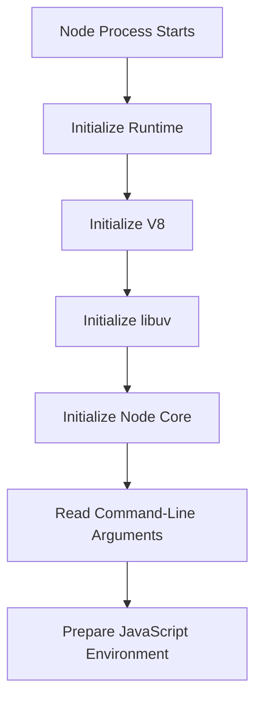

# Starting Node.js

> *"The CPU is now executing the Node.js executable. But your JavaScript still hasn't started."*

---

# Learning Objectives

After completing this chapter, you will understand:

- What Node.js actually is
- Why Node.js is called a runtime
- What happens when Node.js starts
- The role of V8
- The role of libuv
- Why JavaScript alone cannot access your operating system
- The complete Node.js startup sequence

---

# Prerequisites

Before reading this chapter, you should understand:

- CPU Fundamentals
- RAM
- Processes
- Threads
- Process Creation
- Executable Loading
- CPU Fetch → Decode → Execute Cycle

---

# Where We Are

Our journey so far:

```text
Keyboard

↓

Operating System

↓

Terminal

↓

Shell

↓

Find npm

↓

Create Process

↓

Load Executable

↓

CPU Executes

↓

Node.js Starts
```

This is the first chapter where we leave the Operating System and enter the **Node.js Runtime**.

---

# A Common Misconception

Many beginners think:

```bash
node app.js
```

means:

```text
JavaScript

↓

CPU
```

That is **not** what happens.

The CPU is executing the **Node.js executable**, not your JavaScript file.

Your JavaScript hasn't even been opened yet.

---

# What Is Node.js?

Many people answer:

> "Node.js is JavaScript."

Incorrect.

Others say:

> "Node.js is V8."

Also incorrect.

The correct answer is:

> **Node.js is a JavaScript Runtime built on top of the V8 JavaScript Engine.**

---

# What Does "Runtime" Mean?

A runtime is the environment that allows a program to execute.

Think about a fish.

A fish cannot live without water.

Likewise:

JavaScript cannot interact with your computer without a runtime.

The runtime provides everything the language itself does not have.

---

# JavaScript Alone

Imagine JavaScript without Node.js.

```javascript
console.log("Hello");
```

It can:

- Variables
- Functions
- Objects
- Loops
- Arrays

But...

Can it read a file?

❌ No

Can it create a server?

❌ No

Can it access your SSD?

❌ No

Can it create network sockets?

❌ No

---

# Why?

Because JavaScript is only a language.

Languages define:

- Syntax
- Variables
- Functions
- Objects
- Classes

Languages do **not** define:

- File systems
- Networks
- Operating System APIs

Someone must provide those capabilities.

---

# Enter Node.js

Node.js provides APIs like:

```javascript
fs.readFile()

http.createServer()

net.Socket()

process.exit()

setTimeout()
```

These are **Node APIs**.

They are **not part of JavaScript itself**.

---

# Big Picture

```text
                    Node.js Runtime

┌────────────────────────────────────────────┐
│                                            │
│              Your JavaScript               │
│                                            │
├────────────────────────────────────────────┤
│               Node.js APIs                 │
│ fs   http   path   crypto   timers         │
├────────────────────────────────────────────┤
│                 libuv                      │
├────────────────────────────────────────────┤
│                  V8                        │
├────────────────────────────────────────────┤
│            Operating System                │
└────────────────────────────────────────────┘
```

---

# The Major Components

Node.js isn't one program.

It's built from several major parts.

```text
Node.js

├── V8
├── libuv
├── Node Core APIs
├── C++ Bindings
└── Operating System APIs
```

Each component has a different responsibility.

---

# V8

V8 is Google's JavaScript Engine.

Its job:

- Parse JavaScript
- Create an AST
- Generate Bytecode
- Optimize Hot Code
- Execute JavaScript

That's it.

V8 **does not** know how to:

- Open files
- Listen on ports
- Create TCP sockets

---

# libuv

libuv is one of the most important pieces of Node.js.

Most frontend developers have heard of it.

Few understand it.

libuv provides:

- Event Loop
- Thread Pool
- Timers
- Asynchronous File I/O
- Network I/O

Without libuv:

Node.js could not perform asynchronous work.

---

# Node Core APIs

When you write:

```javascript
const fs = require("fs");
```

you're using a Node.js API.

Internally:

```text
JavaScript

↓

Node API

↓

C++

↓

libuv

↓

Operating System
```

---

# C++ Bindings

Node.js itself is mostly written in C++.

Why?

Because JavaScript cannot directly call Operating System functions.

The C++ layer acts as a bridge.

Conceptually:

```text
JavaScript

↓

C++

↓

Operating System
```

---

# Startup Sequence

When the CPU begins executing the Node executable:

Node.js performs initialization.



Notice something important.

Your JavaScript file is still waiting.

---

# Reading Command-Line Arguments

Suppose you typed:

```bash
node app.js
```

Node first reads:

```text
Argument 0

node
```

```text
Argument 1

app.js
```

It now knows:

> "The user wants me to execute app.js."

---

# Environment Variables

Node also receives information from the Operating System.

Examples:

```text
PATH

HOME

USER

PWD

TEMP
```

These become available through:

```javascript
process.env
```

Example:

```javascript
console.log(process.env.PATH);
```

The values come from the operating system—not JavaScript itself.

---

# Node Creates Global Objects

Before your code runs, Node prepares several globals.

Examples:

```javascript
console

process

Buffer

setTimeout

setInterval

clearTimeout

clearInterval
```

These appear "magically."

They actually come from Node.js.

---

# Where Is V8 Right Now?

At this moment:

```text
Node Runtime

↓

Initialize V8

↓

Waiting
```

V8 has started.

But it hasn't parsed your JavaScript file yet.

That happens next.

---

# Under the Hood

When Node starts, it performs tasks similar to:

1. Initialize internal data structures
2. Initialize V8
3. Initialize libuv
4. Configure the Event Loop
5. Create Node global objects
6. Read command-line arguments
7. Locate the JavaScript entry file

Only after these steps is Node ready to ask V8 to execute JavaScript.

---

# Engineering Thinking

Many developers think:

> "Node runs JavaScript."

A systems engineer thinks:

> "The Operating System started a Node process. The CPU executes the Node executable. Node initializes V8, libuv, internal APIs, global objects, and runtime configuration before handing the JavaScript source code to V8."

That is a much more accurate mental model.

---

# Try It Yourself

Create a file:

```javascript
console.log(process.argv);
```

Run:

```bash
node app.js hello world
```

Example output:

```text
[
  '/usr/local/bin/node',
  '/path/to/app.js',
  'hello',
  'world'
]
```

Notice that Node receives command-line arguments before executing your application logic.

---

# Common Misconceptions

❌ Node.js is JavaScript.

✅ Node.js is a JavaScript runtime.

---

❌ V8 is Node.js.

✅ V8 is only one component of Node.js.

---

❌ JavaScript can access files directly.

✅ Node provides file system APIs.

---

❌ `setTimeout()` is part of JavaScript.

✅ In Node.js, `setTimeout()` is provided by the runtime.

---

# Performance Notes

Node performs initialization only once when the process starts.

After initialization:

- V8 remains active
- libuv remains active
- The Event Loop continues running until the application exits

Keeping startup efficient is one reason Node applications launch quickly.

---

# Security Notes

Node.js does not automatically sandbox your code.

If your program has permission to read files, delete files, or open network connections, your JavaScript can perform those operations through Node APIs.

Always be careful when running untrusted Node.js applications.

---

# Interview Corner

### Beginner

1. What is Node.js?
2. What is V8?
3. What is a runtime?

### Intermediate

4. Why does JavaScript need Node.js?
5. What is libuv?
6. What are Node Core APIs?

### Advanced

7. Why is Node written largely in C++?
8. What happens before your JavaScript file is parsed?
9. Why can't V8 alone create an HTTP server?

---

# Summary

The CPU is now executing the Node.js executable.

Before your JavaScript begins, Node initializes its runtime by preparing V8, libuv, global objects, environment variables, command-line arguments, and internal APIs.

Only after this initialization does Node hand your JavaScript source code to the V8 engine.

---

# What Actually Happened So Far

```text
✓ Enter key pressed
✓ Terminal received command
✓ Shell parsed command
✓ PATH searched
✓ npm executable found
✓ Process created
✓ PID assigned
✓ Virtual memory allocated
✓ Executable loaded into RAM
✓ CPU executing Node.js
✓ Node runtime initialized
✓ V8 initialized
✓ libuv initialized
✓ Node global APIs prepared

NEXT →

Node gives your JavaScript source code to the V8 engine for parsing.
```

---

# Next Chapter

➡ **Starting V8**

In the next chapter, we'll finally answer one of the biggest questions in JavaScript:

> **How does V8 understand a `.js` file?**

We'll follow the journey from:

- UTF-8 text
- Characters
- Tokens
- Lexer
- Parser
- Abstract Syntax Tree (AST)

By the end of the chapter, you'll understand how a simple text file becomes a structured program that a JavaScript engine can execute.