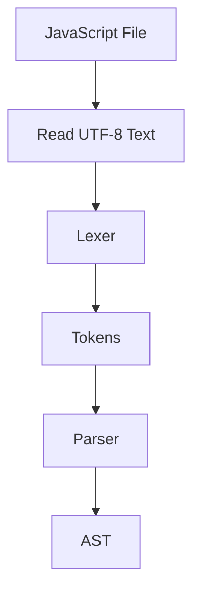

# Starting V8 — From JavaScript Source Code to an AST

> *"To humans, a JavaScript file is readable text. To V8, it's just a sequence of characters that must be transformed into something meaningful."*

---

# Learning Objectives

After completing this chapter, you will understand:

- How V8 reads a JavaScript file
- What UTF-8 encoding is
- What lexical analysis (tokenization) means
- What a parser does
- What an Abstract Syntax Tree (AST) is
- Why JavaScript engines don't execute source code directly

---

# Prerequisites

Before reading this chapter, you should understand:

- CPU Fundamentals
- RAM
- Process Creation
- Node.js Runtime
- Executable Loading

---

# Where We Are

Our journey so far:

```text
You

↓

Keyboard

↓

Terminal

↓

Shell

↓

Operating System

↓

Node.js Runtime

↓

V8 Initialized

↓

???
```

Node.js has finished initializing.

Now it tells V8:

> "Here is the JavaScript file the user wants to run."

For the first time, V8 opens your `.js` file.

---

# A Simple Example

Imagine your file is:

```javascript
const message = "Hello World";

console.log(message);
```

To you, this is readable JavaScript.

To V8, it's simply bytes stored in memory.

---

# Step 1 — Reading the File

Node.js has already loaded the file from disk.

V8 receives the file contents.

Conceptually:

```text
app.js

↓

Characters in Memory

↓

V8
```

The CPU still doesn't understand JavaScript.

V8 must translate it.

---

# What Is UTF-8?

Computers don't store letters like:

```text
A

B

C

😀
```

Instead, everything is stored as numbers.

Example:

```text
Character      UTF-8 Value

A              65

B              66

C              67

a              97

1              49
```

Your `.js` file is simply a sequence of encoded bytes.

---

# Inside Memory

Conceptually:

```text
app.js

const a = 10;

↓

RAM

63 6F 6E 73 74 ...

↓

V8 Reads Bytes
```

V8 converts those bytes back into characters.

---

# Step 2 — Lexical Analysis

Now V8 begins its first major task.

This stage is called:

```text
Lexical Analysis
```

or

```text
Tokenization
```

Its job is to break the source code into meaningful pieces called **tokens**.

---

# What Is a Token?

Imagine reading English.

Sentence:

```text
The cat sat.
```

Your brain naturally separates it into words.

Similarly, V8 separates JavaScript into tokens.

---

# Example

Source code:

```javascript
const age = 25;
```

Tokens:

```text
Keyword

const
```

```text
Identifier

age
```

```text
Operator

=
```

```text
Number

25
```

```text
Semicolon

;
```

Each token has a specific meaning.

---

# Visual Representation

```text
Source Code

const age = 25;

↓

Lexer

↓

┌──────────────┐
│ const        │
├──────────────┤
│ age          │
├──────────────┤
│ =            │
├──────────────┤
│ 25           │
├──────────────┤
│ ;            │
└──────────────┘
```

---

# The Lexer

The component responsible for tokenization is called the:

```text
Lexer
```

or

```text
Tokenizer
```

Its only responsibility is:

> "Read characters and produce tokens."

It does **not** understand program logic.

---

# Step 3 — Parsing

Once tokenization is complete, the tokens are passed to the parser.

The parser asks questions such as:

- Is the syntax valid?
- Are parentheses balanced?
- Are braces matched?
- Does this statement follow JavaScript grammar?

If the answer is **no**, parsing stops.

---

# Example of Invalid Syntax

```javascript
const = age 20;
```

V8 reports:

```text
SyntaxError
```

Your program never executes because parsing failed.

---

# Step 4 — Building an AST

If parsing succeeds, V8 builds an:

```text
Abstract Syntax Tree

(AST)
```

The AST represents the structure of your program.

It is **not** your source code.

It is **not** machine code.

It is a structured representation that V8 can analyze.

---

# Example

Source code:

```javascript
const age = 25;
```

Simplified AST:

```text
Program
│
└── VariableDeclaration
    │
    ├── Keyword: const
    │
    ├── Identifier
    │      │
    │      └── age
    │
    └── Literal
           │
           └── 25
```

---

# Larger Example

```javascript
function add(a, b) {
  return a + b;
}
```

Simplified AST:

```text
Program
│
└── FunctionDeclaration
    │
    ├── Name
    │     └── add
    │
    ├── Parameters
    │     ├── a
    │     └── b
    │
    └── Body
          │
          └── ReturnStatement
                 │
                 └── BinaryExpression
                        │
                        ├── a
                        ├── +
                        └── b
```

Notice how the AST describes **relationships**, not formatting.

---

# Why Build an AST?

Consider these two programs:

```javascript
const x=10;
```

and

```javascript
const x = 10;
```

The spacing is different.

The meaning is identical.

Both produce nearly the same AST.

This allows V8 to ignore formatting and focus on structure.

---

# Complete Flow



---

# What Happens If Parsing Fails?

Example:

```javascript
function () {
```

The parser reaches the end of the file.

It expected:

```javascript
}
```

Instead:

```text
Unexpected end of input
```

Execution stops immediately.

The AST is never completed.

---

# Under the Hood

When V8 parses your program, it also begins collecting information such as:

- Variable declarations
- Function declarations
- Scope information
- Module imports
- Strict mode rules

These details help later stages of execution and optimization.

---

# Engineering Thinking

Many developers think:

> "V8 executes JavaScript."

An engineer thinks:

> "V8 first reads UTF-8 encoded source code, performs lexical analysis, generates tokens, validates syntax through the parser, and constructs an Abstract Syntax Tree before any execution begins."

That is a much more accurate picture of what actually happens.

---

# Try It Yourself

Create a file:

```javascript
const total = 100;
```

Now intentionally introduce an error:

```javascript
const = total 100;
```

Run:

```bash
node app.js
```

Observe that Node reports a `SyntaxError`.

Notice that the program never reaches execution.

---

# Common Misconceptions

❌ V8 executes JavaScript directly from the source file.

✅ V8 first parses the source code into an AST.

---

❌ The lexer understands JavaScript logic.

✅ The lexer only produces tokens.

---

❌ Whitespace changes program structure.

✅ Most whitespace is ignored during parsing.

---

❌ Syntax errors happen while executing code.

✅ Syntax errors happen before execution begins.

---

# Performance Notes

Parsing large JavaScript files takes time.

Modern JavaScript engines optimize parsing using techniques such as:

- Lazy parsing
- Background parsing
- Incremental parsing

These reduce startup time for large applications.

---

# Security Notes

Before executing code, V8 validates JavaScript syntax.

Rejecting invalid programs early helps prevent unpredictable execution and ensures the engine only works with well-formed code.

---

# Interview Corner

### Beginner

1. What is a token?
2. What is lexical analysis?
3. What does a parser do?

### Intermediate

4. What is an AST?
5. Why doesn't V8 execute source code directly?
6. What happens if parsing fails?

### Advanced

7. Why do JavaScript engines build an AST?
8. What information is collected during parsing?
9. Why are lazy parsing techniques useful?

---

# Summary

Node.js has now handed your JavaScript source code to V8.

V8 reads the UTF-8 encoded text, converts it into characters, performs lexical analysis to produce tokens, validates the program using a parser, and builds an Abstract Syntax Tree (AST).

At this point, V8 understands the structure of your program—but it still hasn't executed a single JavaScript statement.

The AST is the blueprint that the next stage of the engine will use to generate executable instructions.

---

# What Actually Happened So Far

```text
✓ Enter key pressed
✓ Terminal received command
✓ Shell parsed command
✓ PATH searched
✓ npm executable found
✓ Process created
✓ Executable loaded into RAM
✓ CPU started executing
✓ Node.js runtime initialized
✓ V8 initialized
✓ JavaScript file loaded
✓ UTF-8 decoded
✓ Lexer generated tokens
✓ Parser validated syntax
✓ AST created

NEXT →

V8 converts the AST into Bytecode using the Ignition interpreter.
```

---

# Next Chapter

➡ **Ignition: From AST to Bytecode**

In the next chapter, you'll learn:

- What Bytecode is
- Why V8 doesn't generate machine code immediately
- How the Ignition interpreter works
- What the Bytecode Interpreter does
- Why JavaScript starts executing so quickly
- How V8 prepares hot code for TurboFan optimization

By the end of the next chapter, your JavaScript program will finally begin executing.