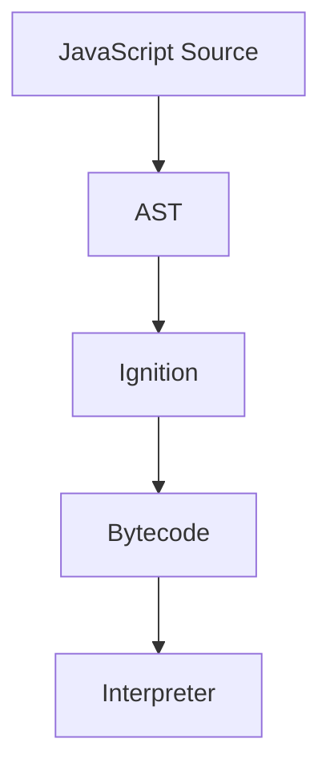

# Ignition — From AST to Bytecode

> *"The AST tells V8 what your program means. Bytecode tells V8 how to execute it."*

---

# Learning Objectives

After completing this chapter, you will understand:

- Why V8 doesn't compile directly to machine code
- What Bytecode is
- What the Ignition Interpreter does
- How JavaScript begins executing
- What an Interpreter actually is
- How Ignition and TurboFan work together

---

# Prerequisites

Before reading this chapter, you should understand:

- CPU Fundamentals
- Fetch → Decode → Execute Cycle
- Node.js Runtime
- V8 Parsing
- Abstract Syntax Tree (AST)

---

# Where We Are

Our journey so far:

```text
Keyboard

↓

Terminal

↓

Shell

↓

Operating System

↓

Node.js Runtime

↓

V8

↓

Lexer

↓

Parser

↓

AST

↓

???
```

V8 now understands your program.

But the CPU still cannot execute an AST.

The AST is only a blueprint.

---

# Why Can't the CPU Execute an AST?

Imagine this JavaScript:

```javascript
const a = 10;
const b = 20;

console.log(a + b);
```

The AST looks something like:

```text
Program

↓

VariableDeclaration

↓

CallExpression
```

Can the CPU execute:

```text
VariableDeclaration
```

No.

The CPU understands only machine instructions.

The AST must first be transformed into another representation.

---

# Why Not Generate Machine Code Immediately?

This is an excellent question.

Why doesn't V8 simply do this?

```text
AST

↓

Machine Code
```

Because compiling every JavaScript file into machine code before execution would take too long.

Imagine opening a website.

Would you want the browser to spend several seconds compiling thousands of JavaScript files before showing anything?

Of course not.

JavaScript was designed to start quickly.

---

# The Solution

V8 uses two stages.

```text
AST

↓

Bytecode

↓

Machine Code (Later)
```

This gives us:

- Fast startup
- High performance later

This is one of the reasons V8 is so fast.

---

# What Is Bytecode?

Bytecode is a simplified instruction language.

It is much closer to machine code than JavaScript.

But it is still independent of the CPU.

Think of it as an intermediate language.

---

# Analogy

Imagine translating English into Japanese.

Instead of translating directly:

```text
English

↓

Japanese
```

you first translate into a universal language.

```text
English

↓

Universal Format

↓

Japanese
```

Bytecode is that universal format.

---

# Introducing Ignition

The component responsible for generating and executing Bytecode is called:

```text
Ignition
```

Ignition is V8's **Interpreter**.

Its responsibilities are:

- Read the AST
- Generate Bytecode
- Execute Bytecode

---

# Big Picture

```text
JavaScript

↓

Lexer

↓

Tokens

↓

Parser

↓

AST

↓

Ignition

↓

Bytecode

↓

Execute
```

---

# What Is an Interpreter?

An interpreter executes instructions one by one.

Conceptually:

```text
Instruction 1

↓

Execute

↓

Instruction 2

↓

Execute

↓

Instruction 3

↓

Execute
```

Unlike a traditional compiler, it doesn't need to convert the entire program into machine code before starting.

---

# Example

JavaScript:

```javascript
let total = 5 + 10;
```

The AST might describe:

```text
Addition

↓

5

↓

10
```

Ignition converts this into bytecode.

Conceptually:

```text
LoadConstant 5

LoadConstant 10

Add

Store total
```

Notice something.

This is **not JavaScript anymore.**

---

# Is Bytecode Machine Code?

No.

Many beginners confuse these.

```text
JavaScript

↓

Bytecode

↓

Machine Code
```

Bytecode is an intermediate representation.

Machine code is what the CPU ultimately executes.

---

# Visual Flow



---

# Example Bytecode

Real V8 bytecode is much more complex.

A simplified example:

```text
LdaSmi 10

Star r0

LdaSmi 20

Add r0

Call console.log
```

Don't worry about the instruction names.

The important idea is that JavaScript has now become a low-level instruction sequence.

---

# Ignition Starts Running

Once Bytecode is generated:

```text
Instruction 1

↓

Instruction 2

↓

Instruction 3

↓

Instruction 4
```

Ignition begins executing them.

At this point:

Your JavaScript program is finally running.

---

# Wait...

Didn't we already learn that the CPU executes instructions?

Yes.

Here's the important distinction.

The CPU executes **machine instructions**.

Ignition executes **bytecode instructions**.

So what really happens?

```text
CPU

↓

Node.js

↓

V8

↓

Ignition

↓

Read Bytecode

↓

CPU Executes Ignition's Machine Code

↓

Ignition Executes Your JavaScript Logic
```

This is an extremely important concept.

The CPU is never executing JavaScript directly.

---

# Why Is This Fast?

Suppose your application contains:

```text
10,000 functions
```

Do all of them execute immediately?

No.

Only the code that actually runs needs to be interpreted.

This keeps startup time very fast.

---

# Preparing for Optimization

Ignition does more than execute.

While running your program, it observes behavior.

For example:

```javascript
function multiply(a, b) {
    return a * b;
}
```

If this function executes:

```text
1 time

↓

10 times

↓

100 times

↓

1000 times
```

Ignition notices:

> "This function is very popular."

It marks the function as **hot**.

---

# Hot Code

Hot code means:

```text
Frequently Executed Code
```

Examples:

- Rendering loops
- Animation logic
- React rendering
- Game loops
- Array sorting

These are excellent candidates for optimization.

---

# What Happens Next?

Ignition tells another V8 component:

```text
TurboFan

↓

Please optimize this function.
```

TurboFan will later compile the hot function into machine code.

We'll study that in the next chapter.

---

# Under the Hood

Internally, Ignition:

- Traverses the AST
- Generates bytecode instructions
- Creates execution contexts
- Allocates stack frames
- Begins interpreting bytecode
- Collects profiling information
- Detects hot functions

This happens incredibly quickly.

---

# Engineering Thinking

Many developers think:

> "V8 executes JavaScript."

An engineer thinks:

> "V8 transforms JavaScript into an AST. Ignition generates bytecode from the AST, interprets that bytecode, profiles execution, and identifies hot functions for TurboFan optimization."

That mental model explains why JavaScript starts quickly while still achieving excellent performance.

---

# Try It Yourself

Node.js allows you to inspect generated bytecode.

Create a file:

```javascript
function add(a, b) {
    return a + b;
}

add(10, 20);
```

Run:

```bash
node --print-bytecode app.js
```

You'll see hundreds of bytecode instructions.

Don't worry if they look confusing.

The goal is simply to confirm that V8 really generates bytecode before optimization.

---

# Common Misconceptions

❌ V8 converts JavaScript directly into machine code.

✅ V8 first generates bytecode.

---

❌ Bytecode is machine code.

✅ Bytecode is an intermediate instruction format.

---

❌ Ignition is a compiler.

✅ Ignition is primarily an interpreter that generates and executes bytecode.

---

❌ Every function is optimized immediately.

✅ Only frequently executed ("hot") functions are optimized.

---

# Performance Notes

Generating machine code for every function would increase startup time.

Ignition provides:

- Fast startup
- Low compilation cost
- Runtime profiling

TurboFan later provides:

- Maximum execution speed
- CPU-specific machine code
- Advanced optimizations

This hybrid approach gives JavaScript both fast startup and high performance.

---

# Security Notes

Before bytecode is executed:

- Syntax has already been validated.
- The AST has already been built.
- Runtime checks continue to protect memory and execution.

The CPU still never executes JavaScript source code directly.

---

# Interview Corner

### Beginner

1. What is bytecode?
2. What is Ignition?
3. Why doesn't V8 compile directly to machine code?

### Intermediate

4. What is the difference between bytecode and machine code?
5. Why does JavaScript start quickly?
6. What is an interpreter?

### Advanced

7. What is hot code?
8. How does Ignition help TurboFan?
9. Why is a two-stage execution pipeline more efficient?

---

# Summary

Your JavaScript program has finally begun executing.

V8 transforms the AST into bytecode using the Ignition interpreter.

Ignition executes bytecode immediately, giving JavaScript excellent startup performance while collecting runtime information about which parts of the program execute most frequently.

Those frequently executed sections—called **hot code**—will soon be handed to TurboFan for optimization into highly efficient machine code.

---

# What Actually Happened So Far

```text
✓ Enter key pressed
✓ Terminal received command
✓ Shell parsed command
✓ PATH searched
✓ Process created
✓ Executable loaded into RAM
✓ CPU executing Node.js
✓ Node.js initialized
✓ V8 initialized
✓ JavaScript source loaded
✓ Lexer created tokens
✓ Parser built AST
✓ Ignition generated bytecode
✓ Bytecode execution started

NEXT →

TurboFan begins optimizing hot JavaScript functions into native machine code.
```

---

# Next Chapter

➡ **TurboFan: Optimizing JavaScript into Machine Code**

In the next chapter, you'll discover:

- What Just-In-Time (JIT) compilation is
- How TurboFan identifies hot functions
- Speculative optimization
- Deoptimization
- Inline caching
- Hidden classes
- Why JavaScript can approach the speed of compiled languages

This chapter explains the technology that made modern JavaScript one of the fastest dynamic programming languages in the world.