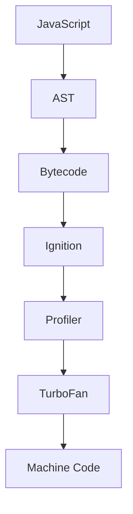

# TurboFan — Optimizing JavaScript into Machine Code

> *"Ignition gets your program running quickly. TurboFan makes it run incredibly fast."*

---

# Learning Objectives

After completing this chapter, you will understand:

- What Just-In-Time (JIT) compilation is
- Why TurboFan exists
- What "hot code" means
- How TurboFan generates machine code
- What speculative optimization is
- What deoptimization is
- Why JavaScript can be surprisingly fast

---

# Prerequisites

Before reading this chapter, you should understand:

- CPU Fundamentals
- Fetch → Decode → Execute
- AST
- Bytecode
- Ignition Interpreter

---

# Where We Are

Our execution pipeline now looks like this:

```text
JavaScript

↓

Lexer

↓

Parser

↓

AST

↓

Ignition

↓

Bytecode

↓

Execute

↓

???
```

Your JavaScript program is already running.

But something interesting is happening behind the scenes.

Ignition is watching your program.

---

# Why Optimize?

Imagine this function:

```javascript
function add(a, b) {
    return a + b;
}
```

You call it:

```javascript
add(1, 2);
```

Once.

Does it make sense to spend time heavily optimizing it?

No.

The optimization cost would be greater than the performance benefit.

---

Now imagine:

```javascript
for (let i = 0; i < 10000000; i++) {
    add(i, i);
}
```

Now the function runs millions of times.

Optimizing it suddenly becomes worthwhile.

---

# Hot Code

Code that runs frequently is called:

```text
Hot Code
```

Examples:

- React rendering
- Animation loops
- Physics engines
- Sorting algorithms
- Array iteration
- Game loops

Ignition continuously records execution statistics.

---

# The Profiler

Inside V8 is a profiler.

Conceptually:

```text
Function

↓

Executed

↓

Count++

↓

Executed Again

↓

Count++

↓

Executed Again

↓

Hot!
```

Once a function crosses an internal threshold, V8 considers optimizing it.

---

# Enter TurboFan

TurboFan is V8's optimizing compiler.

Its job:

```text
Bytecode

↓

Analysis

↓

Optimization

↓

Machine Code
```

Unlike Ignition, TurboFan produces **real machine instructions** that the CPU can execute directly.

---

# Big Picture



---

# What Is JIT Compilation?

JIT stands for:

```text
Just-In-Time Compilation
```

Instead of compiling everything before execution:

```text
Compile Everything

↓

Run
```

TurboFan uses:

```text
Run

↓

Observe

↓

Optimize

↓

Run Faster
```

This combines the advantages of interpreters and compilers.

---

# Why Is This Better?

Traditional compilation:

```text
Compile Entire Program

↓

Wait

↓

Execute
```

JIT compilation:

```text
Start Immediately

↓

Collect Information

↓

Optimize Only What Matters
```

The result:

- Faster startup
- Better optimization
- Lower memory usage

---

# Machine Code

Suppose TurboFan optimizes:

```javascript
function square(x) {
    return x * x;
}
```

Eventually:

```text
Machine Instructions

MOV

MUL

RETURN
```

Now the CPU executes these instructions directly.

The interpreter is no longer involved for this optimized function.

---

# Speculative Optimization

TurboFan makes educated guesses.

Imagine:

```javascript
function multiply(a, b) {
    return a * b;
}
```

Every call is:

```javascript
multiply(5, 10);

multiply(20, 30);

multiply(1, 2);
```

TurboFan notices:

> "These are always numbers."

So it generates machine code specialized for numeric multiplication.

This is called:

```text
Speculative Optimization
```

---

# What If the Guess Is Wrong?

Later:

```javascript
multiply("Hello", 10);
```

Oops.

The assumption is no longer true.

The optimized machine code cannot safely handle this new case.

---

# Deoptimization

When assumptions become invalid:

```text
Optimized Machine Code

↓

Invalid Assumption

↓

Discard

↓

Return To Ignition
```

This process is called:

```text
Deoptimization

(Deopt)
```

The application continues running correctly.

Only performance changes temporarily.

---

# Why Is Deoptimization Necessary?

JavaScript is dynamically typed.

The same variable can contain:

```javascript
let value = 10;

value = "Hello";

value = {};

value = [];
```

Because types can change at runtime, TurboFan must sometimes abandon optimized code.

Correctness is always more important than speed.

---

# Inline Caching

Another optimization used by V8 is:

```text
Inline Cache

(IC)
```

Suppose:

```javascript
user.name
```

The first access requires work.

TurboFan remembers where the property lives.

Future accesses become much faster.

---

# Hidden Classes

Objects in JavaScript appear dynamic.

Example:

```javascript
const person = {
    name: "Alice",
    age: 30
};
```

Internally, V8 creates hidden metadata describing the object's structure.

These are called:

```text
Hidden Classes
```

Objects with the same shape can share optimization strategies.

---

# Example

```javascript
const a = {
    x: 1,
    y: 2
};

const b = {
    x: 10,
    y: 20
};
```

Both objects have the same structure.

TurboFan can optimize property access efficiently.

---

Now compare:

```javascript
const c = {
    y: 2,
    x: 1,
    z: 3
};
```

Different property order and shape.

Different hidden class.

Too many different shapes reduce optimization opportunities.

---

# Performance Example

Better:

```javascript
class User {
    constructor(name, age) {
        this.name = name;
        this.age = age;
    }
}
```

Less efficient:

```javascript
const user = {};

user.name = "Alice";

if (Math.random()) {
    user.country = "India";
}
```

Frequently changing object shapes make optimization harder.

---

# Execution Pipeline

```text
JavaScript

↓

AST

↓

Bytecode

↓

Ignition

↓

Profiler

↓

Hot Function

↓

TurboFan

↓

Machine Code

↓

CPU Executes Directly
```

---

# Under the Hood

TurboFan performs many advanced optimizations.

Examples include:

- Constant folding
- Dead code elimination
- Inlining
- Loop optimization
- Escape analysis
- Register allocation
- Instruction scheduling

Entire books are written about compiler optimization techniques.

---

# Engineering Thinking

Many developers think:

> "JavaScript is interpreted."

That is only partially true.

A more accurate statement is:

> "JavaScript begins execution through the Ignition interpreter. Frequently executed code is compiled by TurboFan into optimized machine code using Just-In-Time compilation."

That hybrid model is one reason modern JavaScript engines are extremely fast.

---

# Try It Yourself

Create:

```javascript
function add(a, b) {
    return a + b;
}

for (let i = 0; i < 1000000; i++) {
    add(i, i);
}
```

Run:

```bash
node --trace-opt app.js
```

You'll see V8 report optimization events.

Try:

```bash
node --trace-deopt app.js
```

to observe deoptimization when assumptions change.

---

# Common Misconceptions

❌ JavaScript is always interpreted.

✅ Modern JavaScript engines both interpret and compile.

---

❌ TurboFan compiles everything.

✅ TurboFan primarily compiles hot code.

---

❌ Machine code is generated before execution.

✅ Machine code is generated while the program is already running.

---

❌ Deoptimization means an error occurred.

✅ Deoptimization is a normal part of JIT compilation.

---

# Performance Notes

TurboFan improves performance by:

- Eliminating unnecessary work
- Reusing cached information
- Specializing machine code
- Optimizing hot execution paths

Applications with stable object shapes and predictable data types are generally easier to optimize.

---

# Security Notes

TurboFan performs aggressive optimizations, but it must always preserve JavaScript's language semantics.

If an optimization could change observable program behavior, V8 will reject or reverse it through deoptimization.

Correctness always takes priority over performance.

---

# Interview Corner

### Beginner

1. What is TurboFan?
2. What is JIT compilation?
3. What is hot code?

### Intermediate

4. Why doesn't TurboFan optimize every function?
5. What is speculative optimization?
6. What is deoptimization?

### Advanced

7. What are hidden classes?
8. What is an inline cache?
9. Why can stable object shapes improve performance?

---

# Summary

Your JavaScript program is now running at full speed.

Ignition starts execution quickly using bytecode while collecting runtime information.

When a function becomes "hot," TurboFan compiles it into optimized machine code tailored to the observed behavior of your application.

If those assumptions later become invalid, V8 safely deoptimizes the function and falls back to Ignition before potentially optimizing it again.

This combination of interpretation and Just-In-Time compilation gives JavaScript both fast startup and excellent long-term performance.

---

# What Actually Happened So Far

```text
✓ Enter key pressed
✓ Shell parsed command
✓ PATH searched
✓ Process created
✓ Executable loaded into RAM
✓ CPU executing Node.js
✓ Node.js runtime initialized
✓ V8 initialized
✓ JavaScript parsed
✓ AST generated
✓ Bytecode generated
✓ Ignition executing bytecode
✓ Hot functions detected
✓ TurboFan generated optimized machine code

NEXT →

We'll explore how JavaScript stores variables, objects, functions, and execution contexts in memory using the Stack and Heap.
```

---

# Next Chapter

➡ **JavaScript Memory: Stack, Heap, and Execution Context**

In the next chapter, we'll answer questions every JavaScript developer eventually asks:

- Where does a variable actually live?
- Why are primitives copied but objects shared?
- What is an execution context?
- How does the call stack work?
- Where are objects stored?
- Why does a "Maximum call stack size exceeded" error occur?

By the end of the next chapter, you'll understand exactly how JavaScript uses memory while your program is running.